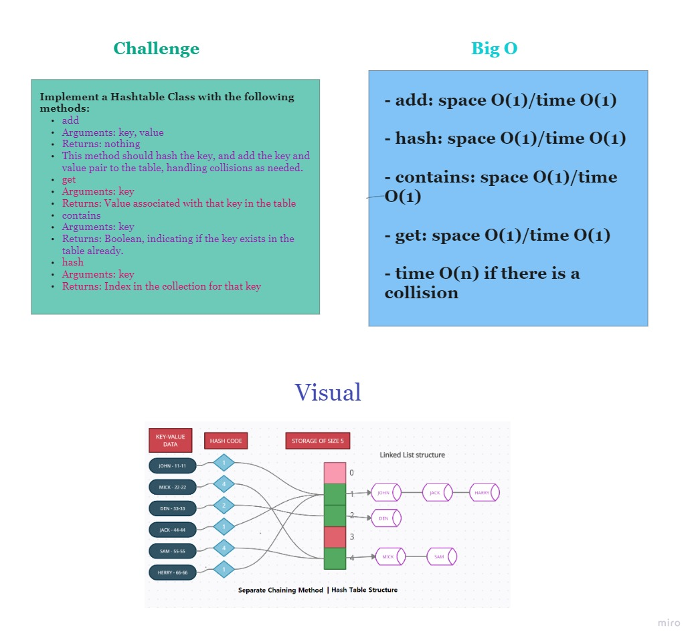

# Hash Tables

Implementing a Hashtable and its methods.

## Challenge

### Features

- `add`: takes in both the key and value. This method should hash the key, and add the key and value pair to the table, handling collisions as needed.

- `get`: takes in the key and returns the value from the table.

- `contains`: takes in the key and returns a boolean, indicating if the key exists in the table already.

- `hash`: takes in an arbitrary key and returns an index in the collection.

### Structure and Testing

Write tests to prove the following functionality:

1) Adding a key/value to your hashtable results in the value being in the data structure.

2) Retrieving based on a key returns the value stored.

3) Successfully returns null for a key that does not exist in the hashtable.

4) Successfully handle a collision within the hashtable.

5) Successfully retrieve a value from a bucket within the hashtable that has a collision.

6) Successfully hash a key to an in-range value

## Approach & Efficiency

- add: space O(1)/time O(1)
- hash: space O(1)/time O(1)
- contains: space O(1)/time O(1)
- get: space O(1)/time O(1)
- time O(n) if there is a collision

## API

1. `add(key, value)` method: it takes a key and a value as an argument,  should hash the key, and add the key and value pair to the table, handling collisions as needed.

2. `hash(key)` method: it takes a key as an argument, and returns value associated with that key in the table.

3. `contains(key)` method: it takes a key as an argument, Returns: Boolean, indicating if the key exists in the table already.

4. `get(key)` method: it takes a key as an argument, Returns: Index in the collection for that key

## Solution
