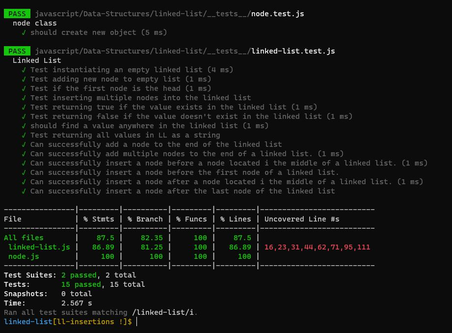
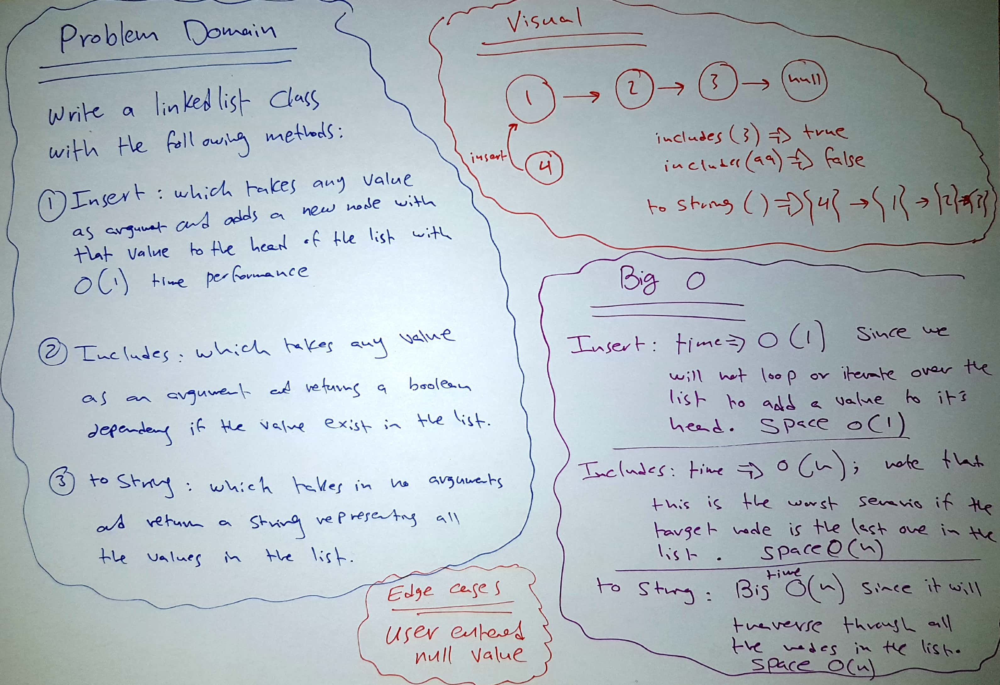
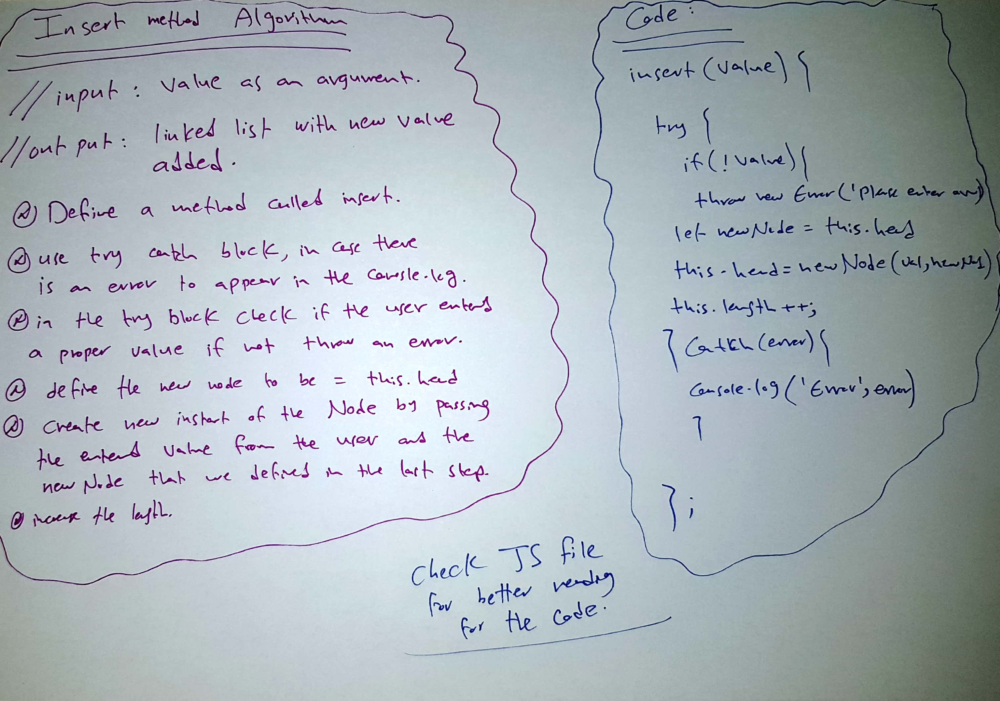
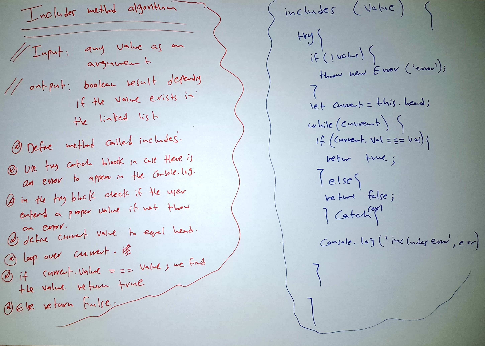
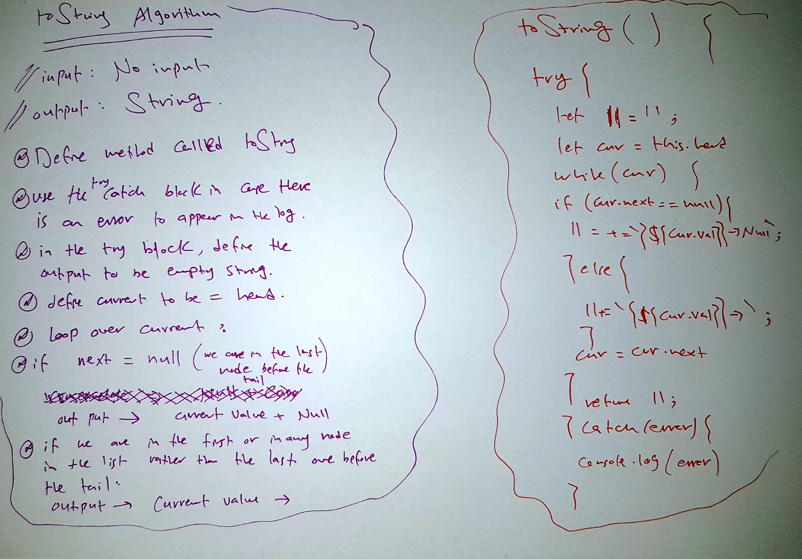
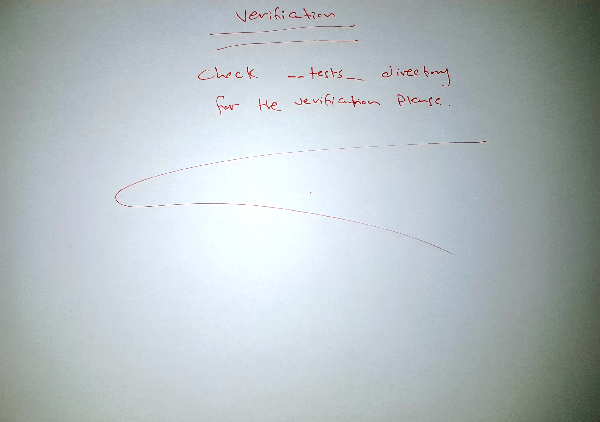
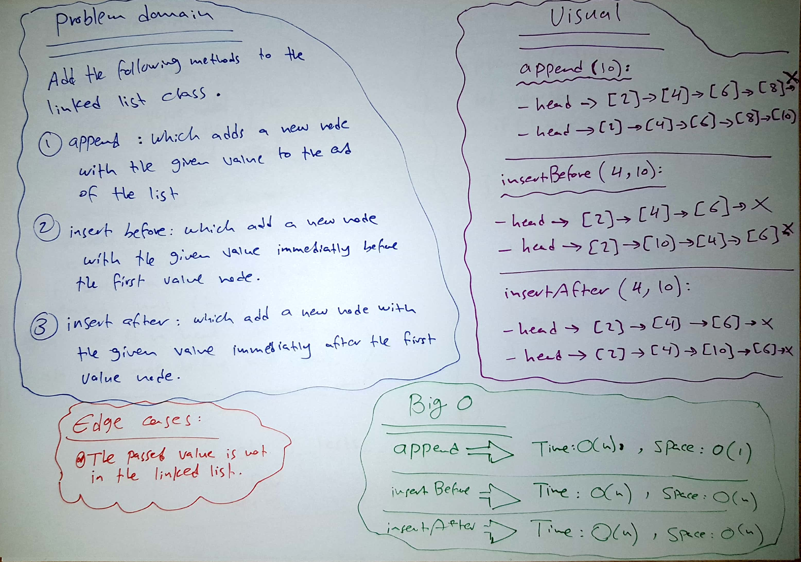
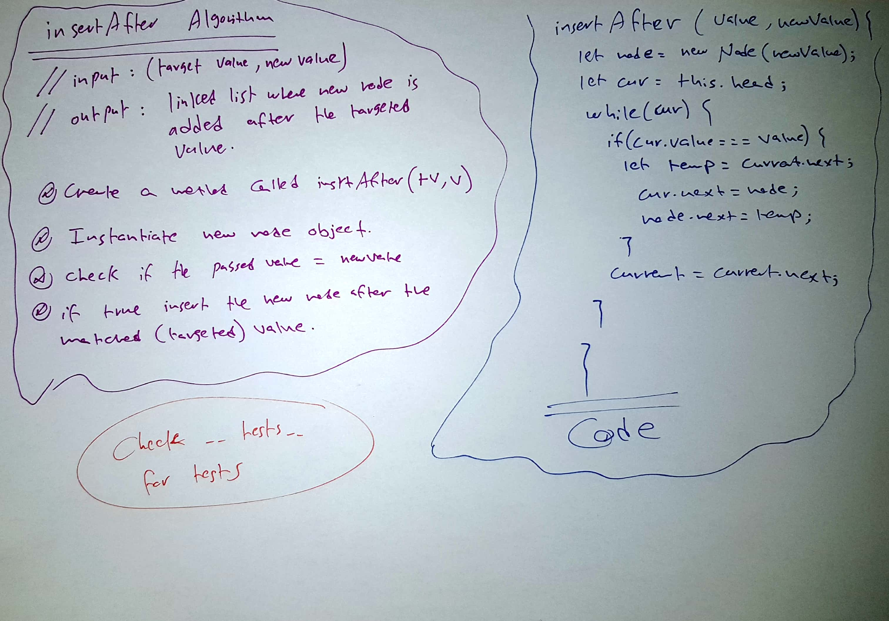
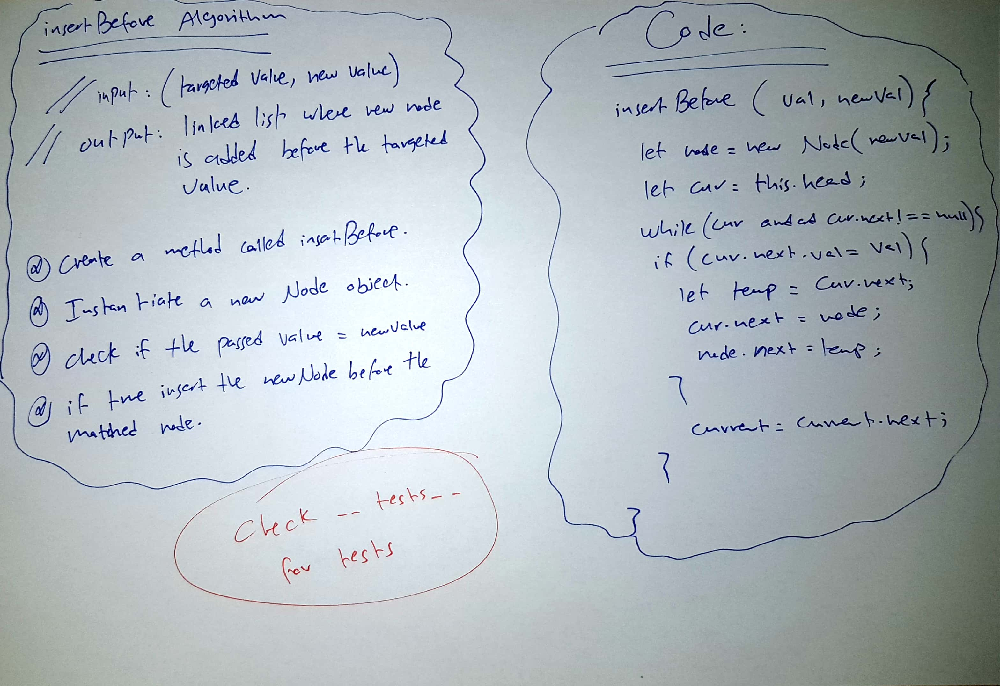
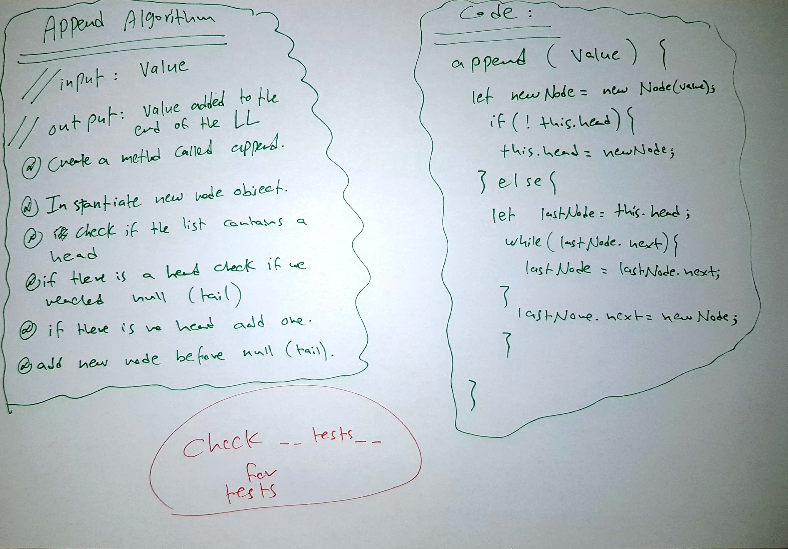

# Linked List

## Challenge

Create a linked list consists of nodes, each node has a value and a reference to the next node in the list. The head of the list is the first node and the tail will be the last node and it will be NULL.
If the list is empty the head value will be NULL.

## Approach & Efficiency

* Each Node always has at least value property and a next property, with the default value of next being null

* When the user `insert` to the  linked list, the new node (recently inserted) will be the head of the list and it will point to the previous head of the list.

* The last node of the list is the tail of the linked list and it  points to null.

## API
* `insert` method: space O(1) and time O(1) : it takes any value as an argument and adds a new node with that value to the head of the list with an O(1) Time performance.

* `includes` method: space O(n) and time O(n) : it takes any value as an argument and returns a boolean result depending on whether that value exists as a Node’s value somewhere within the list.

* `toString` method: space O(n) and time O(n) : takes in no arguments and returns a string representing all the values in the Linked List, formatted as:
`"{ a } -> { b } -> { c } -> NULL"`

* `append` method : which adds a new node with the given value to the end of the list.

* `insertBefore`: which add a new node with the given newValue immediately before the first value node

* `.insertAfter`: which add a new node with the given newValue immediately after the first value node

## Testing

1) Can successfully instantiate an empty linked list.

2) Can properly insert into the linked list.

3) The head property will properly point to the first node in the linked list.

4) Can properly insert multiple nodes into the linked list.

5) Will return true when finding a value within the linked list that exists.

6) Will return false when searching for a value in the linked list that does not exist.

7) Can properly return a collection of all the values that exist in the linked list.

8) Can successfully add a node to the end of the linked list.

9) Can successfully add multiple nodes to the end of a linked list.

10) Can successfully insert a node before a node located i the middle of a linked list.

11) Can successfully insert a node before the first node of a linked list.

12) Can successfully insert after a node in the middle of the linked list.

13) Can successfully insert a node after the last node of the linked list.

## Solution

