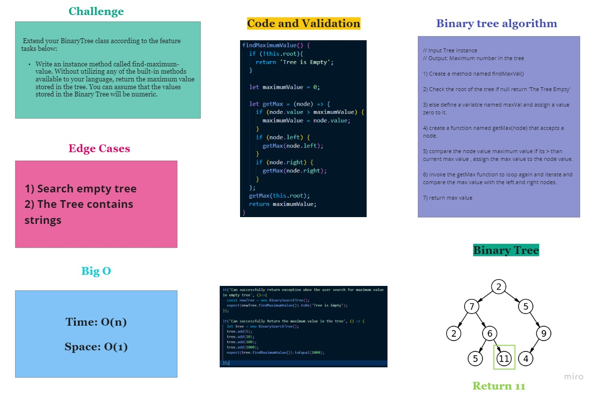

# Trees Data Structure

## Challenge

* Create a Node class that has properties for the value stored in the node, the left child node, and the right child node.

* Create a BinaryTree class with methods for each of the depth first traversals called preOrder, inOrder, and postOrder which returns an array of the values, ordered.

* Create a BinarySearchTree class with add and contains methods.

Check **API** section for more details.

## Approach & Efficiency

### Binary tree 
1) Create Node Class that has value, right and left properties.

2) Create BinaryTree Class with root property.

3) Create preOrder method define empty array that will hold the result then define traverse function that accepts a node then it pushed the root then it checks if there is a left node it will invoke it self again passing the left node this time to be pushed to the results array , on the other hand if there is no left node it will check if there is a right node and invoke it self again passing the right node to be pushed.

4) Create inOrder method define empty array that will hold the result then define traverse function that accepts a node then it checks first if there is a left node if true it will invoke it self passing the left node to be pushed to the results, if there is no lift node it will push the root value to result then it will check if there is a right node if true it will invoke it self passing the right node to be pushed.

5) Create postOrder method, define empty array that will hold the result then define traverse function that accepts a node , check if there is left value if true the function will invoke itself passing the left node, check if there is right node if true the function will invoke itself passing the right node then push the root

### Binary Search tree

1) Create Node Class that has value, right and left properties.

2) Create BinarySearchTree Class with root property.

3) define newNode

4) create add method that accepts a value and check if the root is empty if true it will assign the newNode to be the root.

5) define traverse function that accepts a node and check if the value the user wants to add is less than the node value create newNode for the value and assign it to the left

if the value is bigger than the node , create newNode and assign it to the right.

6) Create a method named contains, that accepts a value, first check if the tree is empty if true return, TREE IS EMPTY, define a variable that will point to the root and iterate over it with a while loop and search for the value , return true if it exists. else retain false.

## API

### Binary Tree Methods:

#### 1) `preOrder()`
Returns an array with the tree values in the following order:

**root > left > right**

#### 2) `inOrder()`

Returns an array with the tree values in the following order:

**left > root > right**

#### 3) `postOrder()`
Returns an array with the tree values in the following order:

**root > left > right**

### Binary Search Tree methods:

#### 1) `add(value)`

Adds the input value in its place in the sorted tree.

#### 2) `contains(value)`

Search the tree and checks if the input value exists.

#### 3) `find-maximum-value`

Without utilizing any of the built-in methods available to your language, return the maximum value stored in the tree. You can assume that the values stored in the Binary Tree will be numeric.

## Testing

1) Can successfully instantiate an empty tree.

2) Can successfully instantiate a tree with a single root node.

3) Can successfully add a left child and right child to a single root node.

4) Can successfully return a collection from a preorder traversal.

5) Can successfully return a collection from an inorder traversal.

6) Can successfully return a collection from a postorder traversal. 

7) Can successfully return exception when the user search for maximum value in empty tree

8) Can successfully Return the maximum value in the tree.

## Solution

