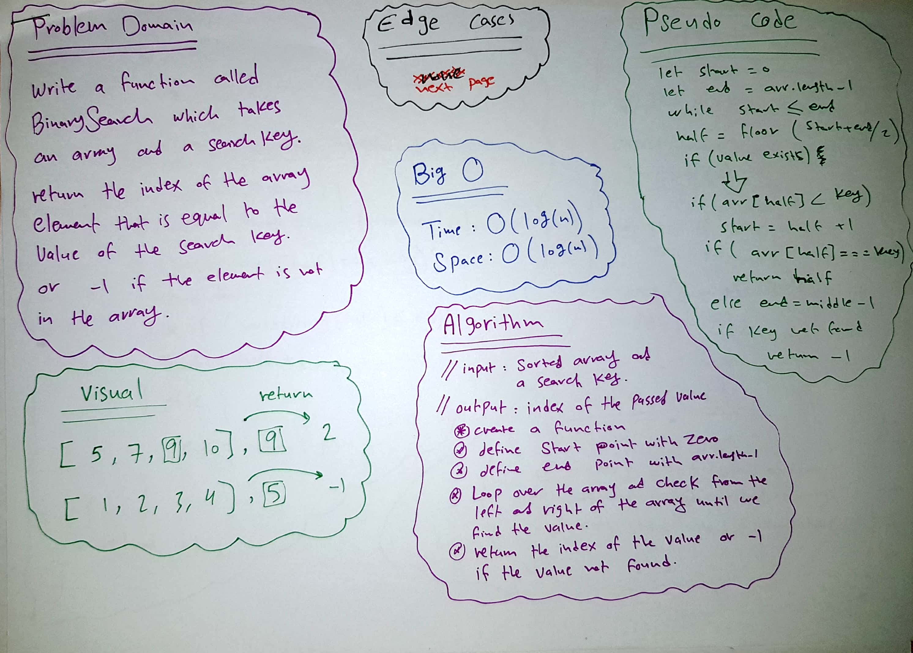
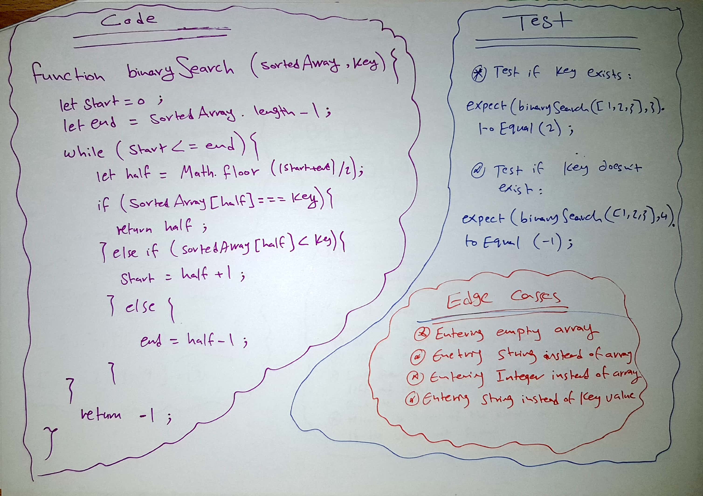

# Array Binary Search

This is a program that takes an array and a search key and return the index of the array’s element that is equal to the value of the search key, or -1 if the element is not in the array.

## Challenge

Write a function called BinarySearch which takes in 2 parameters: a sorted array and the search key. 

Return the index of the array’s element that is equal to the value of the search key, or -1 if the element is not in the array.

## Approach & Efficiency

I created a function that takes an array and an a key, I defined a start point equal to zero and end point equal to arr.length-1 
I used while to loop over the array and check from the left and right of the array until we find the value.

then i returned the index of the value. If the value is not found i returned -1

I used O(n) notation because I'm using for loop here, and it is a liner time so
O(n) will perform better in speed and time.

## Solution

