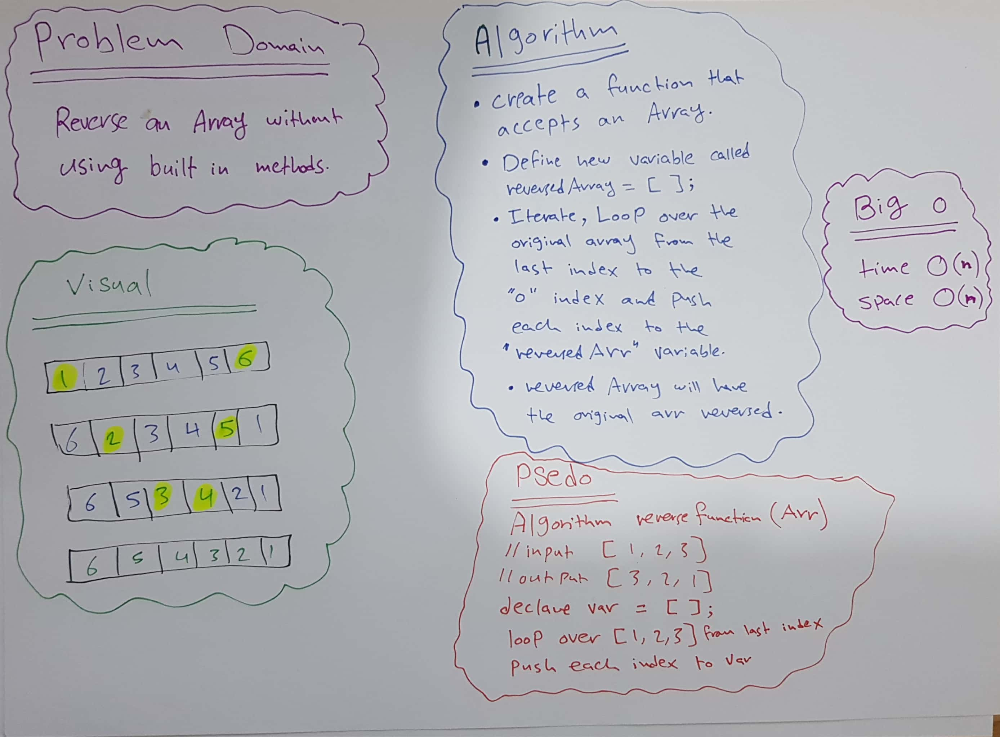
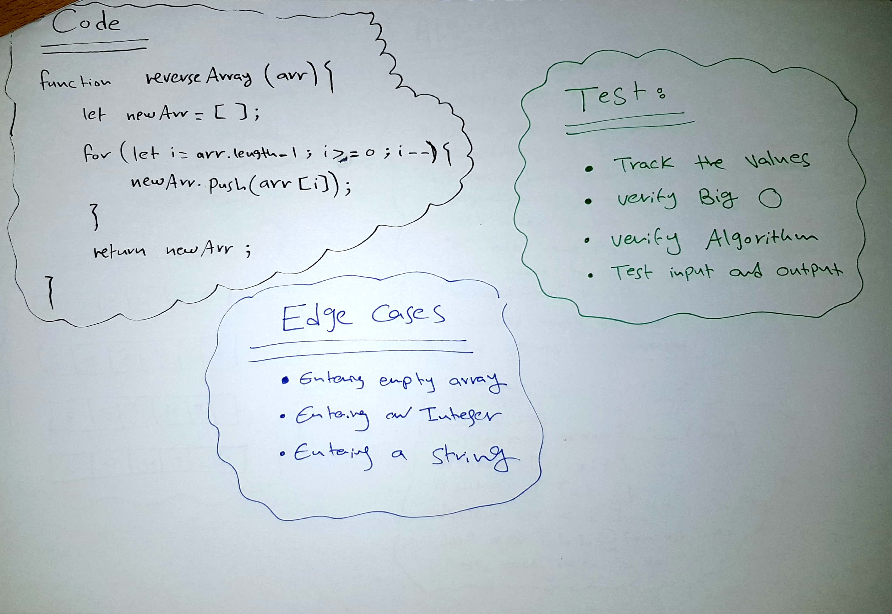

# Array Reverse 

This is a program that takes an array and return it in reversed without using built in methods.

## Challenge

Reverse an array without using a build in method/function.

## Approach & Efficiency

I used O(n) because it is a liner time
O(n) will perform better in speed and time.

## Solution

