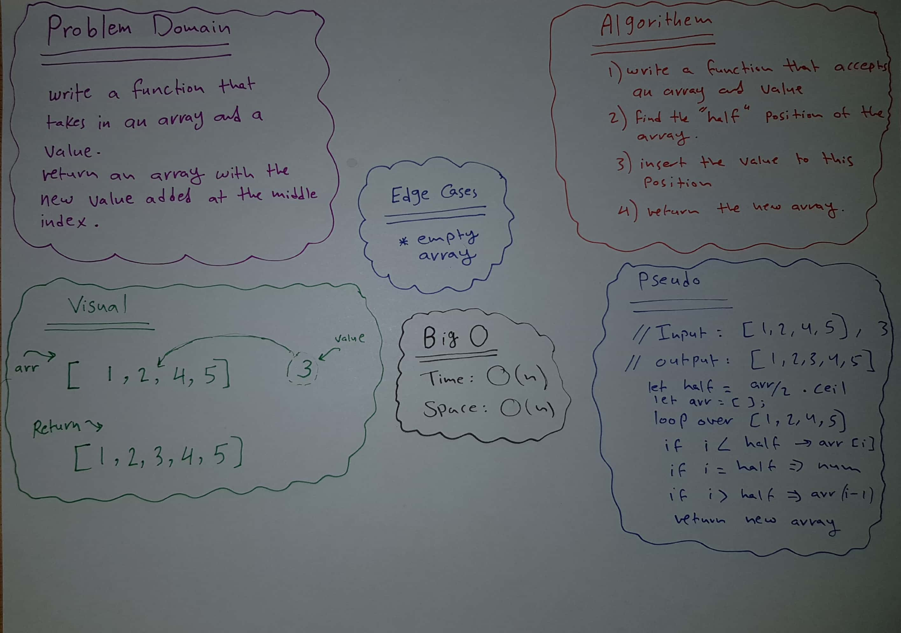
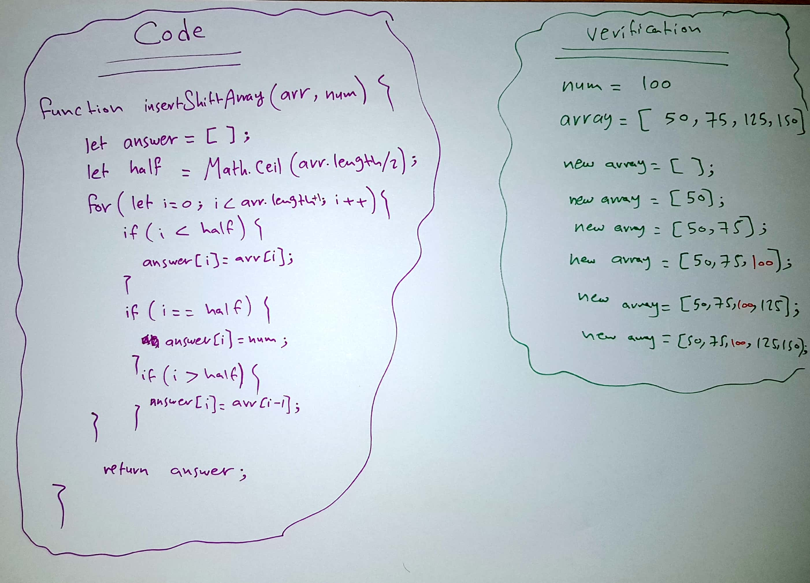

# Array Shift 

This is a program that takes an array and an integer and return a new array where the integer inserted to the middle of the array.

## Challenge

Insert an integer to the middle of an array without using builtin methods.

## Approach & Efficiency
I created a function that takes an array and an integer, I defined a new empty array and i specified the middle of the original array using Math.ceil(arr.length/2) to round the number if it's odd. I looped over the original array, when i is lower than the half position the numbers in the new array will equal to the numbers in the original array, when we reach the middle of the array the index in the new Array will be filled with the integer.

I used O(n) notation because I'm using for loop here, and it is a liner time so
O(n) will perform better in speed and time.

## Solution

