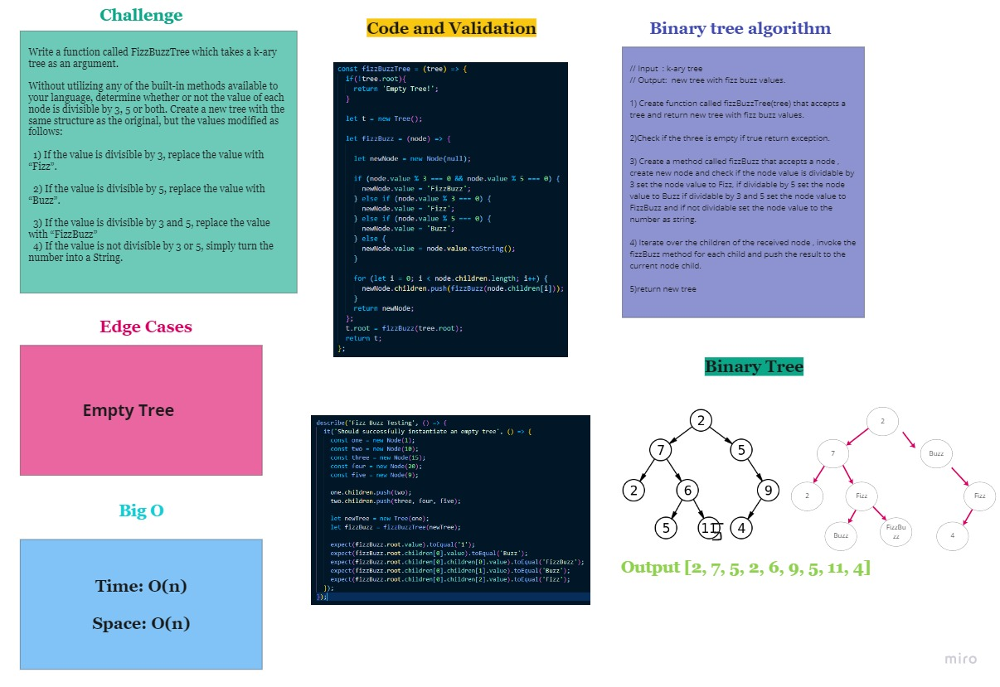

# FizzBuzzTree

## Challenge

Write a function called FizzBuzzTree which takes a k-ary tree as an argument.

Without utilizing any of the built-in methods available to your language, determine whether or not the value of each node is divisible by 3, 5 or both. Create a new tree with the same structure as the original, but the values modified as follows:

  1) If the value is divisible by 3, replace the value with “Fizz”.

  2) If the value is divisible by 5, replace the value with “Buzz”.

  3) If the value is divisible by 3 and 5, replace the value with “FizzBuzz”
  4) If the value is not divisible by 3 or 5, simply turn the number into a String.

## Approach & Efficiency

// Input  : k-ary tree
// Output:  new tree with fizz buzz values.

1) Create function called fizzBuzzTree(tree) that accepts a tree and return new tree with fizz buzz values.

2)Check if the three is empty if true return exception.

3) Create a method called fizzBuzz that accepts a node , create new node and check if the node value is dividable by 3 set the node value to Fizz, if dividable by 5 set the node value to Buzz if dividable by 3 and 5 set the node value to FizzBuzz and if not dividable set the node value to the number as string.

4) Iterate over the children of the received node , invoke the fizzBuzz method for each child and push the result to the current node child.

5)return new tree

Big O 
Time : O(n)
Space: O(n)

## Solution:

