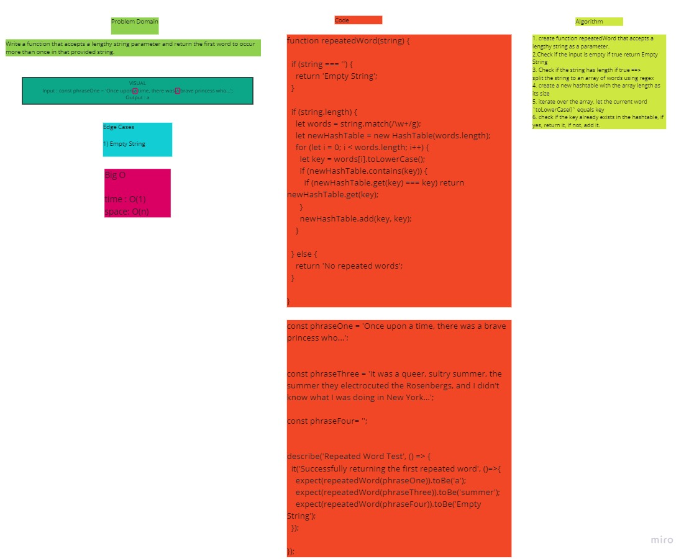

# Repeated Word

Find the first repeated word in a string.

## Challenge

Write a function that accepts a lengthy string parameter and return the first word to occur more than once in that provided string.

## Approach & Efficiency

1. create function repeatedWord that accepts a lengthy string as a parameter.
2. Check if the input is empty if true return Empty String
3. Check if the string has length if true ==>
split the string to an array of words using regex
4. create a new hashtable with the array length as its size
5. iterate over the array, let the current word `toLowerCase()` equals key
6. check if the key already exists in the hashtable, if yes, return it, if not, add it.

- **time:** O(1)
- **space:** O(n)

## Solution

