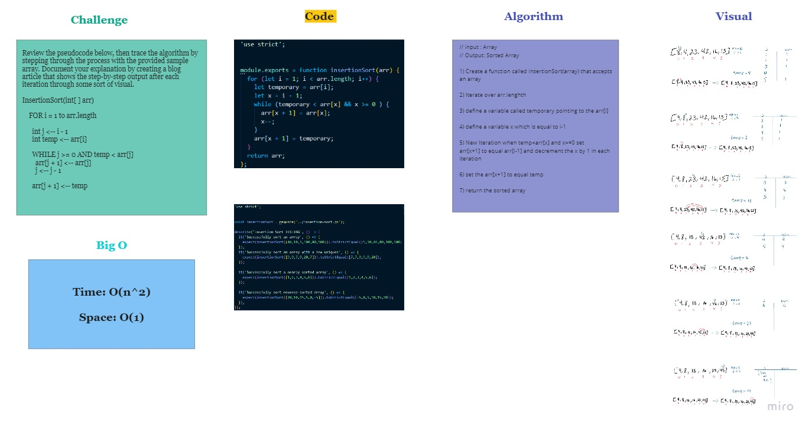

# Insertion Sort 

This is a program that takes an array and return it sorted

## Challenge

Review the pseudocode below, then trace the algorithm by stepping through the process with the provided sample array. Document your explanation by creating a blog article that shows the step-by-step output after each iteration through some sort of visual.
```
InsertionSort(int[ ] arr)

    FOR i = 1 to arr.length

      int j <-- i - 1
      int temp <-- arr[i]

      WHILE j >= 0 AND temp < arr[j]
        arr[j + 1] <-- arr[j]
        j <-- j - 1

      arr[j + 1] <-- temp
```
## Approach & Efficiency
// input : Array

// Output: Sorted Array

1) Create a function called insertionSort(array) that accepts an array

2) Iterate over arr.lenghth

3) define a variable called temporary pointing to the arr[i]

4) define a variable x which is equal to i-1

5) New Iteration when temp<arr[x] and x>=0 set
arr[x+1] to equal arr[i-1] and decrement the x by 1 in each iteration

6) set the arr[x+1] to equal temp

7) return the sorted array

### Efficiency

- Time: O(n^2)

The basic operation of this algorithm is comparison. This will happen n * (n-1) number of times…concluding the algorithm to be n squared.

- Space: O(1)

No additional space is being created. This array is being sorted in place…keeping the space at constant O(1).

## Solution


