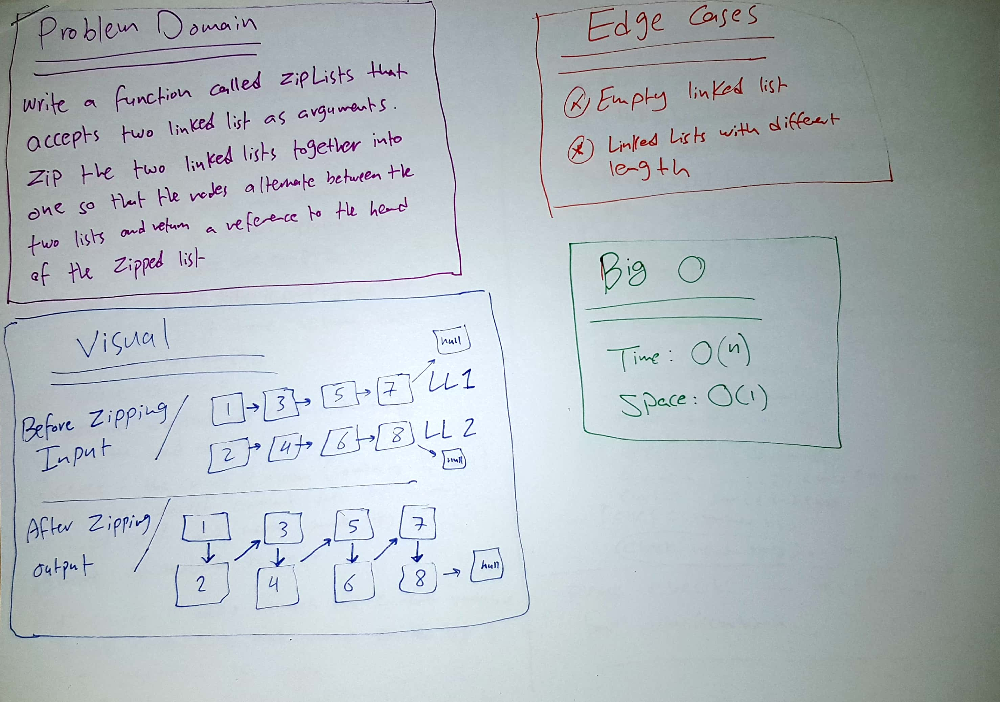
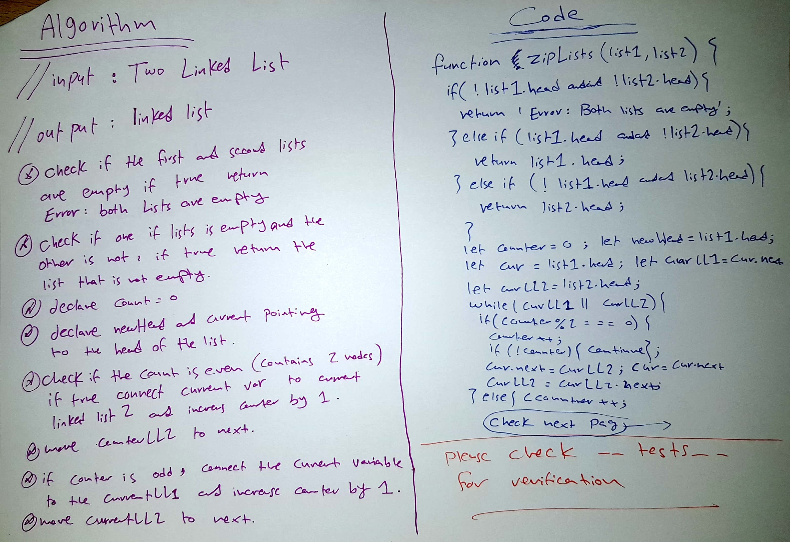
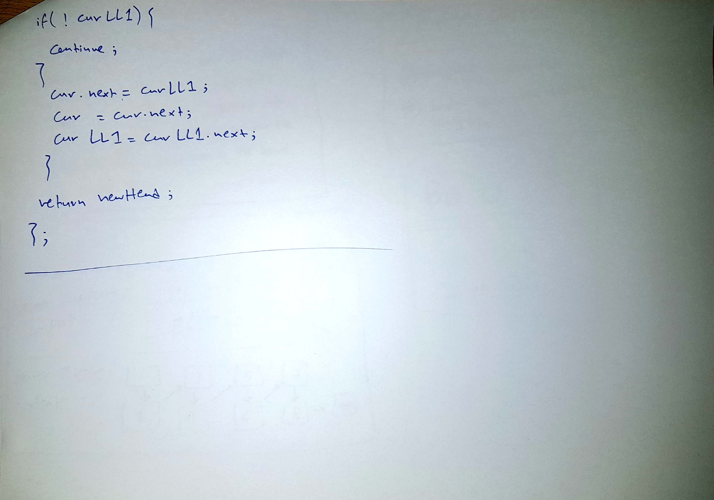

# Zip LinkedList

This is a program that takes two Linked lists as arguments and zip them together into one so that the nodes alternate between the two lists and return a reference to the head of the zipped list.

## Challenge

Write a function called zipLists which takes in 2 Linked lists as parameters.

zip the linked lists together into one so that the nodes alternate between the two lists and return a reference to the head of the zipped list.

## Approach & Efficiency

I created a function that takes two linked lists, first of all i handled the edge cases then i declared a variable called count and I set it's initial value to zero. I declared two variables pointing to the head of the list.
I checked if the count is even if true increase the counter by 1 and connect current variable to current LL2 and move it to next.
On the other hand if counter is odd I also increased counter by 1 and connect the current variable to current LL1 then we I moved current LL2 to next.

Big O 
Time : O(n)
Space: O(1)

## Solution

