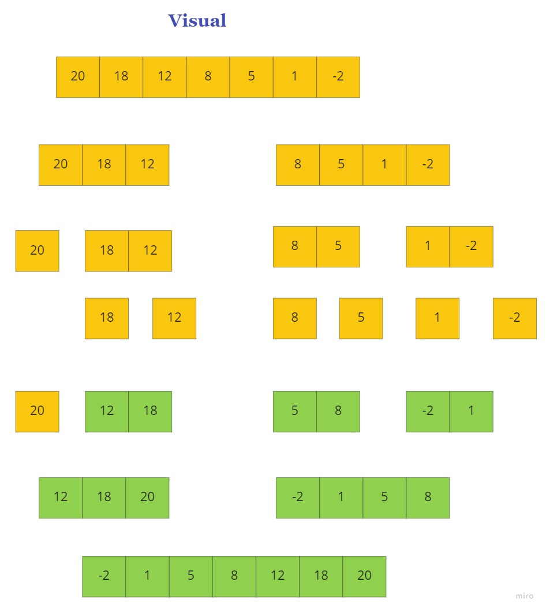

# Merge Sort

Merge Sort is a sorting algorithm that is based off of dividing the array into smaller arrays till the size becomes 1. Once the size becomes 1, the merge processes come into action and start merging arrays back using a helper function till the complete array is merged.

## Pseudocode

```

ALGORITHM Mergesort(arr)
    DECLARE n <-- arr.length
           
    if n > 1
      DECLARE mid <-- n/2
      DECLARE left <-- arr[0...mid]
      DECLARE right <-- arr[mid...n]
      // sort the left side
      Mergesort(left)
      // sort the right side
      Mergesort(right)
      // merge the sorted left and right sides together
      Merge(left, right, arr)

ALGORITHM Merge(left, right, arr)
    DECLARE i <-- 0
    DECLARE j <-- 0
    DECLARE k <-- 0

    while i < left.length && j < right.length
        if left[i] <= right[j]
            arr[k] <-- left[i]
            i <-- i + 1
        else
            arr[k] <-- right[j]
            j <-- j + 1
            
        k <-- k + 1

    if i = left.length
       set remaining entries in arr to remaining values in right
    else
       set remaining entries in arr to remaining values in left
```

## Trace

Sample array: [20,18,12,8,5,1,-2]

### Phase one

divide the array `[20,18,12,8,5,1,-2]` 

- `[20,18,12]` , `[8,5,1,-2]`

- 20 , `[18,12]` // `[8,5]` , `[1,-2]`

- 20 , 18, 12 , 8 , 5 , 1 , -2

### Phase Two

Start Sorting each array

- 20 , [12,18] // [5,8] , [-2,1]

- [12,18,20] // [-2,1,5,8]

- [-2,1,5,8,12,18,20]

Now we have the array sorted



## Efficiency

- Time: O(log n)
- Space: O(n)

