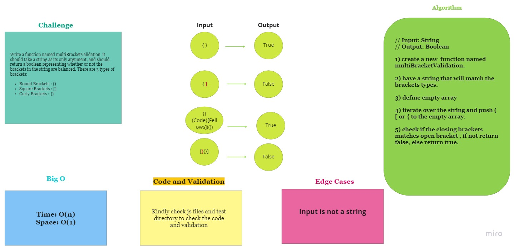

# Array Binary Search

This is a program that takes a string of brackets as input and check if the brackets opening and closing are identical return true, else return false.

## Challenge

Write a function named multiBracketValidation  it should take a string as its only argument, and should return a boolean representing whether or not the brackets in the string are balanced. There are 3 types of brackets:

Round Brackets : ()
Square Brackets : []
Curly Brackets : {}

## Approach & Efficiency

// Input: String

// Output: Boolean

1) create a new  function named multiBracketValidation.

2) have a string that will match the brackets types.

3) define empty array

4) iterate over the string and push ( [ or { to the empty array.

5) check if the closing brackets matches open bracket , if not return false, else return true.

## Solution

