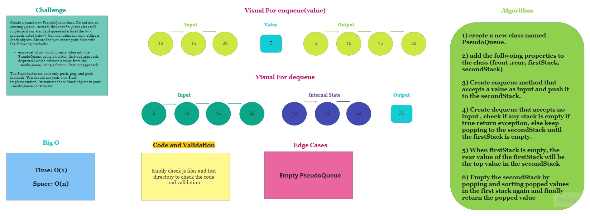

# Stacks and Queues

## Challenge

Build a program that contains a psuedoqueue which receive two stacks as input then apply the enqueue and the dequeue methods.

## Approach & Efficiency
1) create a new class named PseudoQueue.

2) add the follwoing properties to the class (front ,rear, firstStack, secondStack)

3) Create enqueue method that accepts a value as input and push it to the secondStack.

4) Create dequeue that accepts no input , check if any stack is empty if true return exception, else keep popping to the secondStack until the firstStack is empty.

5) When firstStack is empty, the rear value of the firstStack will be the top value in the secondStack

6) Empty the secondStack by popping and sorting popped values in the first stack again and finally return the popped value

## API

1) `enqueue(value)` Adds a node to the queue.

2) `dequeue()` Removes a node from the queue.

## Testing

`npm test`

## Solution

