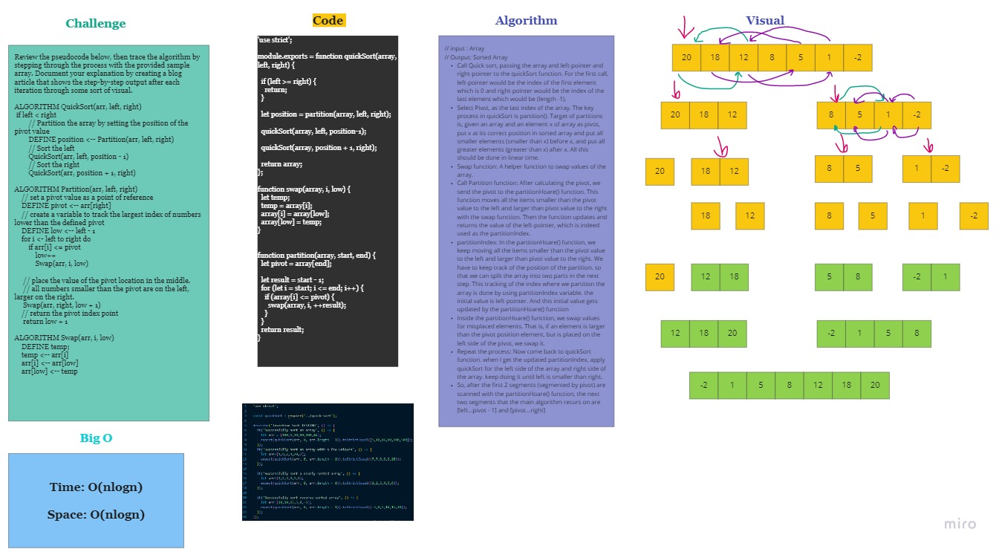

# Merge Sort 

This is a program that takes an array and return it sorted

## Challenge

Review the pseudocode below, then trace the algorithm by stepping through the process with the provided sample array. Document your explanation by creating a blog article that shows the step-by-step output after each iteration through some sort of visual.
```
ALGORITHM QuickSort(arr, left, right)
    if left < right
        // Partition the array by setting the position of the pivot value 
        DEFINE position <-- Partition(arr, left, right)
        // Sort the left
        QuickSort(arr, left, position - 1)
        // Sort the right
        QuickSort(arr, position + 1, right)

ALGORITHM Partition(arr, left, right)
    // set a pivot value as a point of reference
    DEFINE pivot <-- arr[right]
    // create a variable to track the largest index of numbers lower than the defined pivot
    DEFINE low <-- left - 1
    for i <- left to right do
        if arr[i] <= pivot
            low++
            Swap(arr, i, low)

     // place the value of the pivot location in the middle.
     // all numbers smaller than the pivot are on the left, larger on the right. 
     Swap(arr, right, low + 1)
    // return the pivot index point
     return low + 1

ALGORITHM Swap(arr, i, low)
    DEFINE temp;
    temp <-- arr[i]
    arr[i] <-- arr[low]
    arr[low] <-- temp
```
## Approach & Efficiency
// input : Array

// Output: Sorted Array


Call Quick sort, passing the array and left-pointer and right-pointer to the quickSort function.

 For the first call, left-pointer would be the index of the first element which is 0 and right-pointer would be the index of the last element which would be (length -1).


Select Pivot, as the last index of the array. The key process in quickSort is partition(). Target of partitions is, given an array and an element x of array as pivot, put x at its correct position in sorted array and put all smaller elements (smaller than x) before x, and put all greater elements (greater than x) after x. 

All this should be done in linear time.


Swap function: A helper function to swap values of the array.


Call Partition function: After calculating the pivot, we send the pivot to the partitionHoare() function. This function moves all the items smaller than the pivot value to the left and larger than pivot value to the right with the swap function. Then the function updates and returns the value of the left-pointer, which is indeed used as the partitionIndex.


partitionIndex: In the partitionHoare() function, we keep moving all the items smaller than the pivot value to the left and larger than pivot value to the right. We have to keep track of the position of the partition. so that we can split the array into two parts in the next step.

This tracking of the index where we partition the array is done by using partitionIndex variable. the initial value is left-pointer. And this initial value gets updated by the partitionHoare() function
Inside the partitionHoare() function, we swap values for misplaced elements. That is, if an element is larger than the pivot position element, but is placed on the left side of the pivot, we swap it.


Repeat the process: Now come back to quickSort function. when I get the updated partitionIndex, apply quickSort for the left side of the array and right side of the array. keep doing it until left is smaller than right.


So, after the first 2 segments (segmented by pivot) are scanned with the partitionHoare() function, the next two segments that the main algorithm recurs on are [left…pivot - 1] and [pivot…right]


### Efficiency

- Time: O(nlogn)
- Space: O(nlogn)


## Solution

