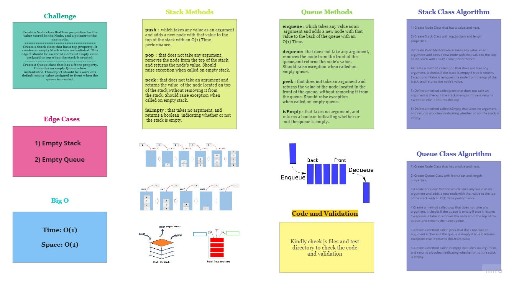

# Stacks and Queues

## Challenge

* Create a Node class that has properties for the value stored in the Node, and a pointer to the next node.

* Create a Stack class that has a top property. It creates an empty Stack when instantiated. This object should be aware of a default empty value assigned to top when the stack is created.

* Create a Queue class that has a front property. It creates an empty Queue when instantiated.This object should be aware of a default empty value assigned to front when the queue is created.

## Approach & Efficiency

## API

### `stack`

* `push ` :  which takes any value as an argument and adds a new node with that value to the top of the stack with an O(1) Time performance.

* `pop ` : that does not take any argument, removes the node from the top of the stack, and returns the node’s value. Should raise exception when called on empty stack.

* `peek` : that does not take an argument and returns the value of the node located on top of the stack, without removing it from the stack.
Should raise exception when called on empty stack.

* `isEmpty` : that takes no argument, and returns a boolean indicating whether or not the stack is empty.

### `Queue` 

*  `enqueue` : which takes any value as an argument and adds a new node with that value to the back of the queue with an O(1) Time.

* `dequeue`:  that does not take any argument, removes the node from the front of the queue, and returns the node’s value.
Should raise exception when called on empty queue.

* `peek` : that does not take an argument and returns the value of the node located in the front of the queue, without removing it from the queue.
Should raise exception when called on empty queue.

* `isEmpty` : that takes no argument, and returns a boolean indicating whether or not the queue is empty.

## Testing

### Stack Testing
1) Can successfully push onto a stack.

2) Can successfully push multiple values onto a stack

3) Can successfully pop off the stack

4) Can successfully empty a stack after multiple pops

5) Can successfully peek the next item on the stack

6) Can successfully instantiate an empty stack

7) Calling pop or peek on empty stack raises exception

### Queue Testing

1) Can successfully enqueue into a queue

2) Can successfully enqueue multiple values into a queue

3) Can successfully dequeue out of a queue the expected value

4) Can successfully peek into a queue, seeing the expected value

5) Can successfully empty a queue after multiple dequeues

6) Can successfully instantiate an empty queue

7) Calling dequeue or peek on empty queue raises exception

## Solution

